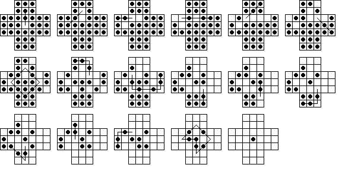
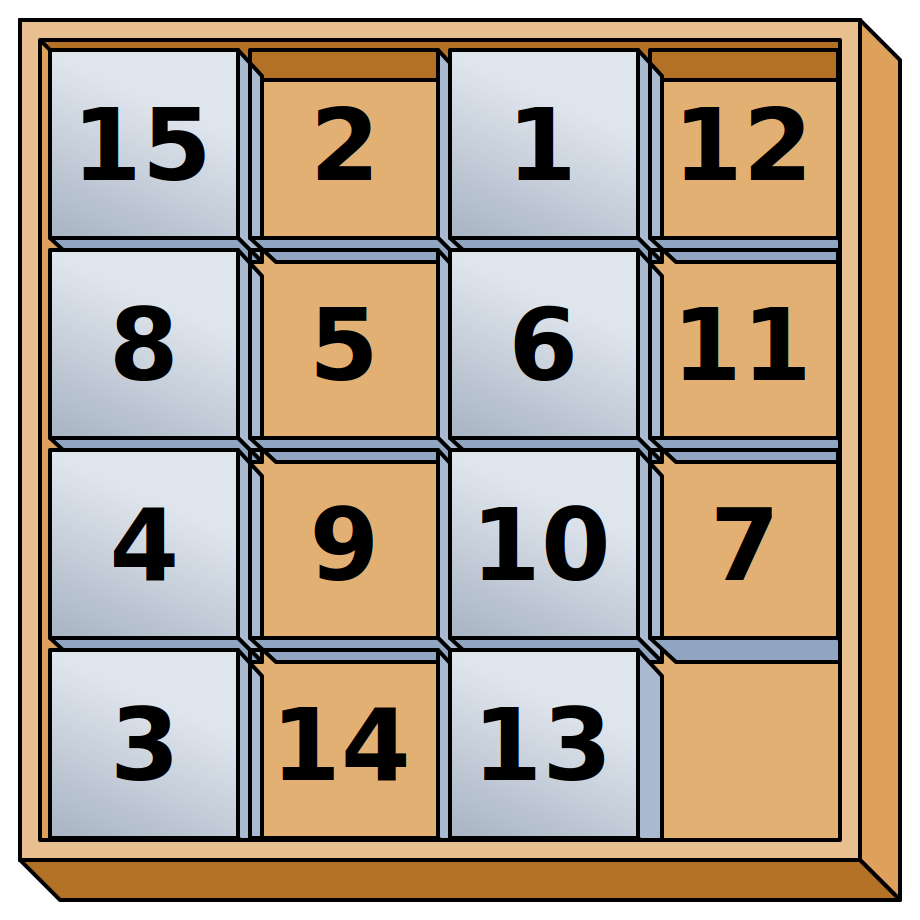
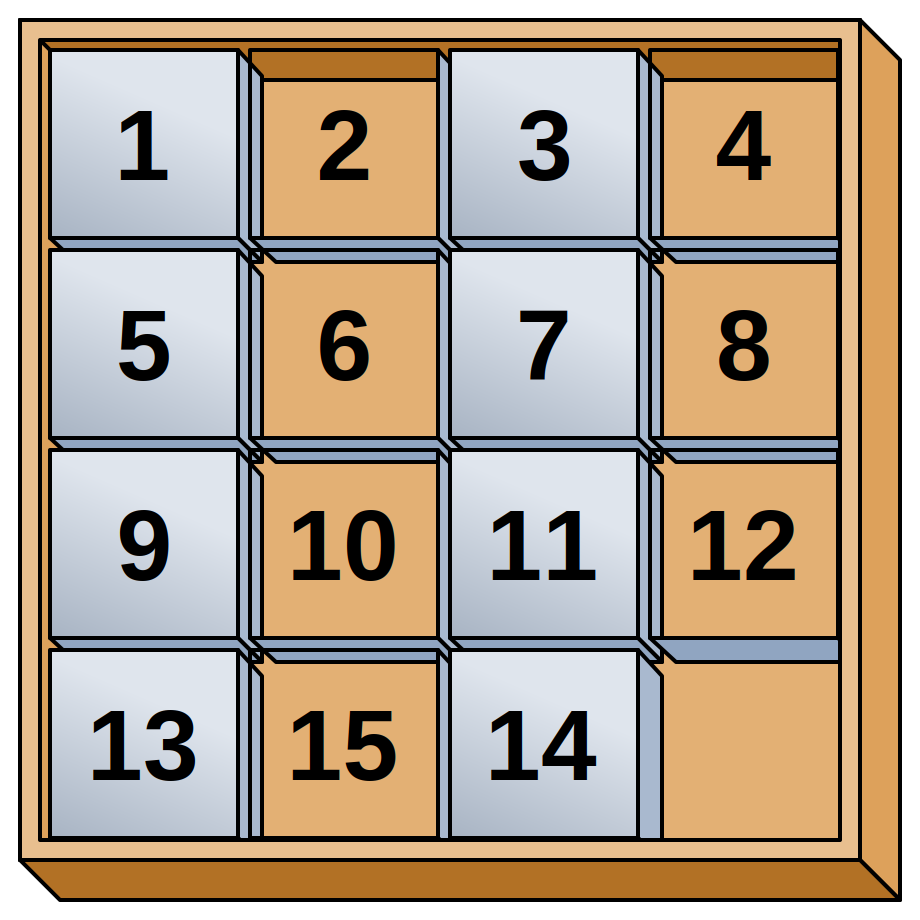

# BFS-DFS-puzzle-solving
Comparison between BFS and DFS in solving several real-world puzzle problems.

## Getting Started

### Prerequisites

* Python 3.x
* Terminal (in Unix) OR PowerShell (in Windows)

### Download source code
```
# Change to HOME directory
$ cd ~

# Clone this repo and 'cd' into it
$ git clone https://github.com/jellycsc/BFS-DFS-puzzle-solving.git
$ cd BFS-DFS-puzzle-solving/
```

### Solving Sudoku
&nbsp;&nbsp;&nbsp;&nbsp;&nbsp;&nbsp;&nbsp;&nbsp;
  
Image source: https://en.wikipedia.org/wiki/Sudoku
```
$ python3 sudoku_puzzle.py
```

### Solving Peg solitaire
  
Image source: http://www.gibell.net/pegsolitaire/diagonal/index.html
```
$ python3 grid_peg_solitaire_puzzle.py
```

### Solving MN puzzle (15-puzzle)
   
Image source: https://en.wikipedia.org/wiki/15_puzzle
```
$ python3 mn_puzzle.py
```

### Solving Word ladder
&nbsp;&nbsp;&nbsp;&nbsp;&nbsp;&nbsp;&nbsp;&nbsp;
  
Image source: http://www.clarity-media.co.uk/aboutpuzzles/word-ladder-puzzle
```
$ python3 word_ladder_puzzle.py
```

## Authors

| Name             | GitHub                                     | Email
| ---------------- | ------------------------------------------ | -------------------------
| Chenjie Ni       | [jellycsc](https://github.com/jellycsc)    | nichenjie2013@gmail.com

## Thoughts and future improvements

* BFS and DFS are both uninformed search algorithms. BFS is capable of finding shortest path solution but it's not memory efficient. In contrast, DFS uses a lot less memory, but it's not guaranteed to find a solution if the depth of the search tree is infinite.
* A* with clever heuristic will save your life.
* [Pacman](http://stanford.edu/~cpiech/cs221/homework/prog/pacman/pacman.html) in Stanford CS221

## Contributing to this project

1. Fork it ( https://github.com/jellycsc/BFS-DFS-puzzle-solving/fork )
2. Create your feature branch (`git checkout -b my-new-feature`)
3. Commit your changes (`git commit -m 'Add some feature'`)
4. Push to your feature branch (`git push origin my-new-feature`)
5. Create a new Pull Request

Details are described [here](https://git-scm.com/book/en/v2/GitHub-Contributing-to-a-Project).

## Bug Reporting
Please log bugs under [Issues](https://github.com/jellycsc/BFS-DFS-puzzle-solving/issues) tab on Github.  
OR you can shoot an email to <nichenjie2013@gmail.com>
